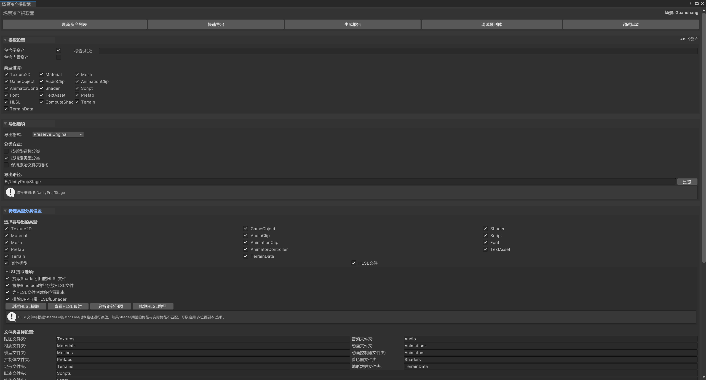
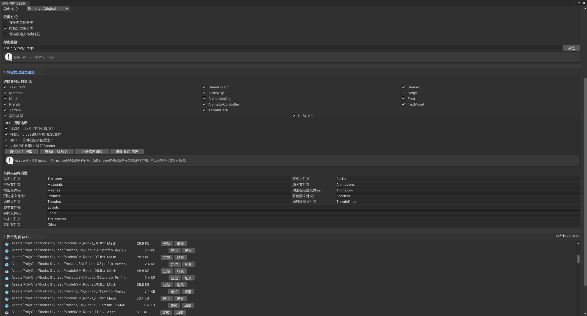

# UnityTools

## 概括

该git库作为自己Unity工具分享的开源库，会不定期分享自己写的unity工具来方便日常工作和创作

## 工具内容

### 场景资产提取工具

最近在迁移老项目的资产但是不想一个个去手动寻找转移，同时想到工作中交接可能也会遇到资产交接，遂开发了这个工具，码了2k多行屎山，目前可能还有一些bug但基本满足我个人的使用了，打算开源一起使用。

工具概述

Unity 场景资产提取器用于从当前场景中自动识别、分类和导出所有相关资产。这个工具能够解决开发者在项目整理、资产迁移和场景分析中遇到的常见问题。

### 主要功能亮点

- **自动资产识别**：智能分析场景中使用的所有资产
- **多格式导出**：支持文件夹复制和 UnityPackage 导出
- **智能分类**：按类型或自定义规则组织资产
- **HLSL 依赖追踪**：自动提取 Shader 引用的 HLSL 文件
- **地形资产支持**：专门处理 Terrain 和 TerrainData 资产
- **脚本识别**：准确识别 MonoScript 和自定义脚本

## 安装与使用

### 安装步骤

1. 将 `SceneAssetExtractor.unitypackage` 拖到unity项目中导入
2. 在 Unity 编辑器中打开菜单：`Tools/场景资产提取器`
3. 工具窗口将显示，可以开始使用

### 基本使用流程

```markdown
1. 打开需要提取资产的场景
2. 点击 "Tools/场景资产提取器" 打开工具窗口
3. 点击 "刷新资产列表" 扫描场景资产
4. 根据需要配置过滤器和导出选项
5. 选择导出方式并执行导出 
```

### 详细使用教程

可以查看下面个人博客的文章

[Unity场景资产提取器 - 完整教程与代码分析 - StellaAstra Blog](https://stellaastra.dpdns.org/posts/sceneassetextractor/sceneassetextractor/)

### 界面UI



